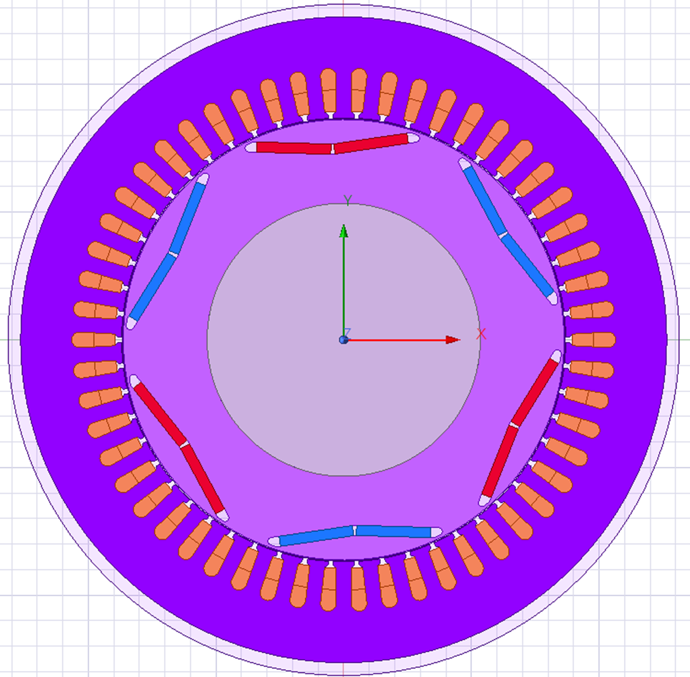
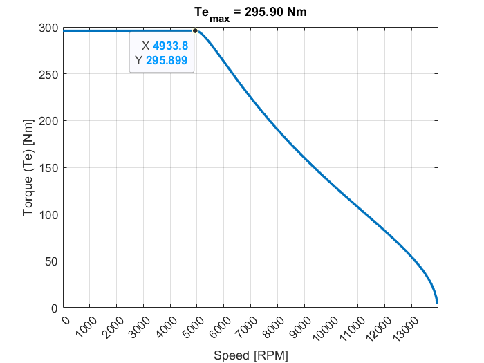
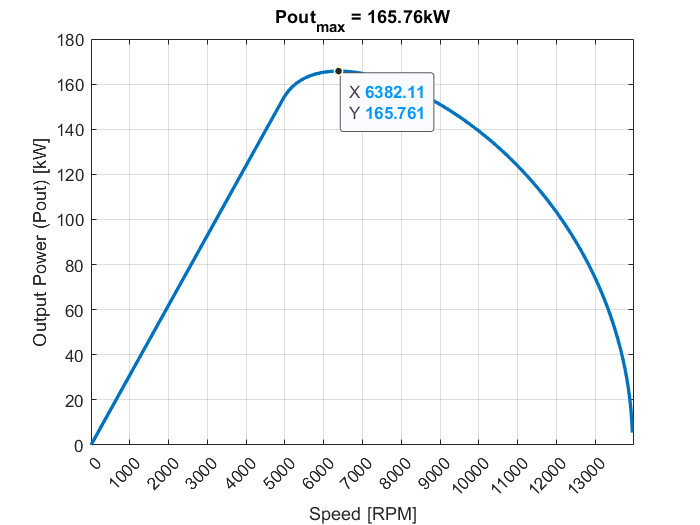
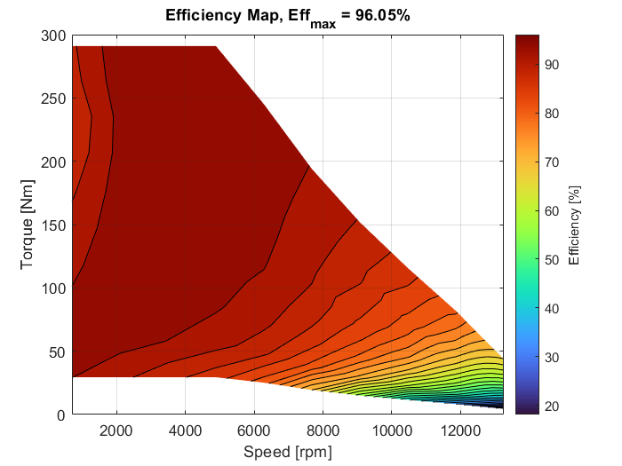
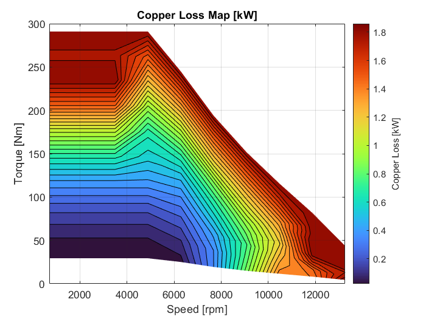
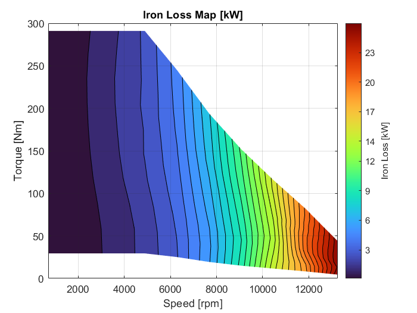

# Design & Analysis of IPMSM using FEM 

## Table of Contents

* [Overview](#overview)
* [Project Objectives](#project-objectives)
* [Design Approach](#design-approach)
* [Key Results](#key-results)
* [Analysis Highlights](#analysis-highlights)
* [Software and Tools](#software-and-tools)
* [Instructions to Use This Project](#instructions-to-use-this-project)
* [Future Work](#future-work)
* [License](#license)
* [Contact](#contact)

## Overview

This project presents the design and FEA of a 6-pole, 54-slot IPMSM for EVs, optimized for high efficiency and torque. The design utilizes Ansys Maxwell and MATLAB, with a focus on achieving 110 kW, 215 Nm, and 95% efficiency.

## Project Objectives

* Rated output power (Pout_rated): 110 kW
* Rated torque output (τout_rated): 215 Nm
* Rated speed (ωbase): 4800 rpm
* Target Efficiency (η): 95%
* Target Power Factor (PF): 0.9
* Maximum outer diameter (Do_max): 330 mm
* Maximum stack length (Lstk_max): 365 mm

These specifications were derived from the TATA Nexon EV 2024 (LR) and comparable EV motors.

## Design Approach

* The motor's initial parameters were determined through analytical calculations. Key aspects included base speed selection relative to the vehicle's top speed, main dimensioning using winding/magnetic/electrical loadings, stator slot geometry based on copper conductor area, and permanent magnet sizing via B-H curve data. Performance indicators such as torque/power density and the motor constant were also calculated.
* Ansys Maxwell was used for FEA simulations to analyze and optimize the IPMSM design.
* Performance metrics, including torque-speed characteristics, efficiency maps, and loss distribution, were evaluated using MATLAB.
* Stator skewing was analyzed to reduce cogging torque and harmonics.
* Lumped parameters were generated for torque-speed curve generation.

## Key Results

* Achieved a maximum efficiency of 96%.
* Delivered a peak torque of 296 Nm.
* Demonstrated stable performance across a wide operating range, suitable for city driving, highway cruising, acceleration, and uphill climbing.
* Analyzed and mapped copper and iron losses, identifying optimal efficiency zones.

## Analysis Highlights

* **Torque-Speed Characteristics:** Constant torque up to 4900 rpm, maximum speed of 13,900 rpm.
      
* **Power-Speed Characteristics:** Peak power of 166 kW at 6380 rpm.
    
* **Efficiency:** High efficiency (90-96%) up to 9000 rpm and 30-290 Nm torque.
    
* **Losses:** Copper losses dominate at low speed/high torque; iron losses at high speed.
    
    

## Software and Tools

* Ansys Maxwell (FEA)
* MATLAB

## Instructions to Use This Project

1.  **Ansys Maxwell:**
    * The Ansys Maxwell software was used to perform Finite Element Analysis (FEA) on the IPMSM design.
    * The FEA simulations focused on analyzing magnetic fields, torque generation, back-EMF, flux linkage, and losses (copper and iron).
    * To understand the FEA setup and results, refer to the detailed documentation provided in the `Documentation_IPMSM/` directory, specifically the "Design\_&\_Analysis\_of\_IPMSM\_using\_FEM.docx" file.
    * The documentation includes information on: Mesh details and boundary conditions, Magnetic loading calculations, Armature field calculations, Demagnetization study, Static torque calculations, Back-EMF and flux linkage calculations, Losses and efficiency calculations, Skew study, Performance mapping and Torque-speed curve generation.
    * Figures 5.66 and 5.67 in the documentation provide detailed copper and iron loss maps, respectively, which illustrate the loss distribution across different operating regions.
2.  **MATLAB (Analysis and Results):**
    * MATLAB was utilized for post-processing and analysis of the FEA data obtained from Ansys Maxwell.
    * The analysis included generating performance curves, such as torque-speed and power-speed characteristics, as well as efficiency maps.
    * The results of these analyses are presented in the `Images/Performance_Curves/` and `Images/Losses_Efficiency_Maps/` directories.
    * Detailed explanations of the analysis methodologies and results can be found in the "Design\_&\_Analysis\_of\_IPMSM\_using\_FEM.docx" file located in the `Documentation_IPMSM/` directory.
3.  **Documentation:**
    * Refer to the `Documentation_IPMSM/` directory for detailed information about the design process, analysis results, and performance characteristics.
    * The "Design\_&\_Analysis\_of\_IPMSM\_using\_FEM.docx" file contains the complete project report, while the "Design\_&\_Analysis\_of\_IPMSM\_using\_FEM.xlsm" file contains the project parameters dataset and the "Design\_&\_Analysis\_of\_IPMSM\_using\_FEM.pptx" file contains overall project details.
4.  **Viewing Results:**
    * The `Images/` directory contains plots and figures that illustrate the motor's performance.

## Future Work

* **Cooling:** Investigate liquid cooling techniques to improve heat dissipation.
* **Optimization:** Optimize the rotor design to minimize iron losses at high speeds.
* **Control:** Implement a field-oriented control strategy in Simulink to evaluate real-time performance.

## License

The documentation and images in this project are licensed under the Creative Commons Attribution 4.0 International License. To view a copy of this license, visit http://creativecommons.org/licenses/by/4.0/.

## Contact

[Mohana Segaran B]
[immohanasegaran30@gmail.com/https://github.com/MohanaSegaran/www.linkedin.com/in/mohana-segaran-322418215]